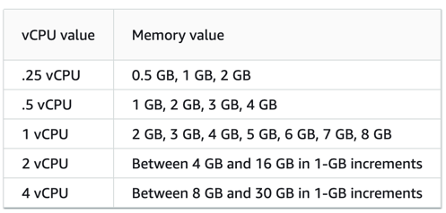
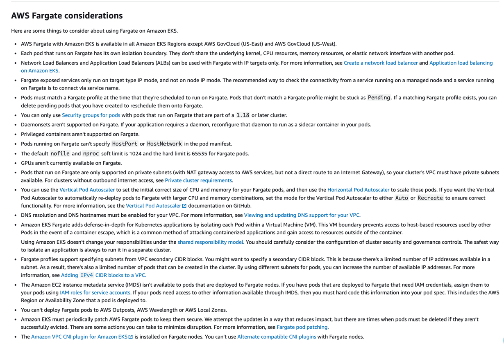

<!--
theme: gaia
class: lead
-->

# AWS Fargate on EKS

---
<!-- theme: gaia -->
# Agenda

* Introduction
* Pricing
* Caveats
* Use cases
* Live Demo

---
<!--
theme: gaia
class: lead
-->

## Introduction

---
<!-- theme: gaia -->

## Introduction

* EC2-less compute platform to run **_unprivileged_** containers
* Underlying node managed by AWS. Not visible on own account console
* Node capacity based on pod request
* One pod, one VM.
---
<!--
theme: gaia
class: lead
-->

## Pricing

---
<!-- theme: gaia -->

## Pricing

[calculator.aws](https://calculator.aws/#/estimate?id=532c2dc7b44eddaf377b26a311c2c70bf7ac1338)

---
<!--
theme: gaia
class: lead
-->

## Caveats

---
<!-- theme: gaia -->

## Caveats

* Fargate Spot not available on EKS 
* AWS CNI is required
* Calico (Kubernetes NetworkPolicies) are not supported
* Deamonsets are not supported.

---
<!-- theme: gaia -->

## Caveats

* Metrics must be send to CloudWatch (break kube-prom-stack)
* Pods that run on Fargate are only supported on private subnets
* No IMDS available (IRSA as fallback)
* Fargate pods periodically restarted (Node patches)
---
<!-- theme: gaia -->

## Caveats

* [Very slow pod start-up time (30s-45s)](https://github.com/aws/containers-roadmap/issues/649)
* Only Amazon EFS PV volumes are supported 

---
<!-- theme: gaia -->

## Caveats

---
<!-- theme: gaia -->

## Caveats

---
<!--
theme: gaia
class: lead
-->

## Use-cases

---
<!-- theme: gaia -->

## Use-cases #1

core-dns

---
<!-- theme: gaia -->

## Use-cases #2

cluster-autoscaler

---
<!--
theme: gaia
class: lead
-->

## Live Demo

---
<!-- theme: gaia -->

## Live Demo

* A EKS cluster (ha-ha)
* Pod execution role
---
<!-- theme: gaia -->

## Live Demo

[eu-central-1.console.aws.amazon.com](https://eu-central-1.console.aws.amazon.com/eks/home?region=eu-central-1#/clusters/jok-fargate-demo?selectedTab=cluster-compute-tab)

---
<!--
theme: gaia
class: lead
-->

## Thanks
