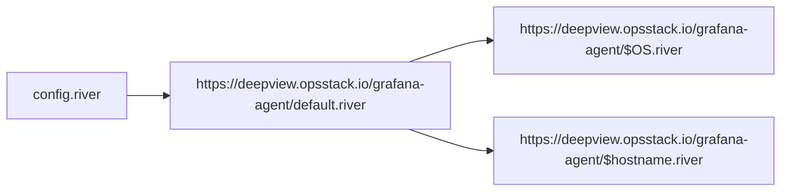

# Remote Agent Structure

Grafana Agent will load config.river from file system

The config.river contains
* Configuration of node_exporter, since it can not be inside a flow module (https://github.com/grafana/agent/issues/3155)
* call default.river and evaluate the content with the node_exporter targets as additional argument

The default.river contains

* metric self scrape
* configuration if remote write endpoint
* call linux.river/windows.river and evaluate the content with the remote_write configuration as additional argument
* call hostname.river and evaluate the content with the remote_write configuration as additional argument

