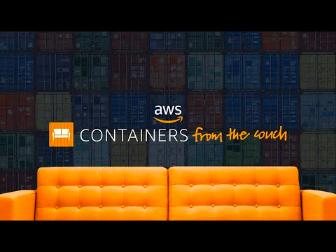

# Kubernetes on ARM

## Implement

* Run on AWS
* No Shell Scripts
* Use ARM Nodes to save money
* Use ASG/spot instances for Control Plane, including etcd, persist data across restart
* Route 53 with DNSSEC signed Zones
* ~~Use IMDSv2 only~~
  * https://github.com/flatcar-linux/Flatcar/issues/220#issuecomment-1079653927 - Waiting for Afterbrun update in Flatcar
* Use SSM Fleet Manager
  * TODO: Configure cloud-watch Agent for system logs
* ~~IPv6 only network~~, IPv6 Dual Stack
  * https://blog.devopstom.com/ipv6-only-ec2/ - Github, DockerHub, SSM has no IPv6 endpoints
  * Amazon EC2 Loadbalancer requires IPv4, no native IPv6 supported
  * Flatcar Provision Tools has no wide IPv6 support
    * https://github.com/coreos/ignition/issues/1340
    * https://github.com/coreos/afterburn/issues/726
* [Flatcar Container Linux](https://www.flatcar.org/)
* [aws-encryption-provider](https://github.com/kubernetes-sigs/aws-encryption-provider)
  * See: https://aws.amazon.com/de/blogs/containers/using-eks-encryption-provider-support-for-defense-in-depth/

## TODO Cluster
* rootless control plane
* ✅ CoreDNS
* ✅ [Run CIS Benchmark](./docs/CIS.md)
* IAM Roles for Service Accounts ([IRSA](https://docs.aws.amazon.com/eks/latest/userguide/iam-roles-for-service-accounts.html))
  * ✅ Using [Service Account Token Volume Projection](https://kubernetes.io/docs/tasks/configure-pod-container/configure-service-account/#service-account-token-volume-projection)
  * ✅ [amazon-eks-pod-identity-webhook](https://github.com/aws/amazon-eks-pod-identity-webhook)
* Kubernetes CNI
  * kube-proxy in IPVS mode
  * ✅ [amazon-vpc-cni-k8s](https://github.com/aws/amazon-vpc-cni-k8s) for Networking
  * [calico](https://projectcalico.docs.tigera.io/getting-started/kubernetes/self-managed-public-cloud/aws#amazon-vpc-cni-plugin) for NetworkPolicy
* Cloud Provider
  * ✅ [cloud-provider-aws](https://github.com/kubernetes/cloud-provider-aws)
  * ✅ [kubelet-csr-approver](https://github.com/postfinance/kubelet-csr-approver) to automatically approve kubelet server crts
* Storage
  * ✅ [aws-ebs-csi-driver](https://github.com/kubernetes-sigs/aws-ebs-csi-driver)
* Node Scaling
  * ✅ [karpenter](https://karpenter.sh/)
  * ✅ [node-termination-handler](https://github.com/aws/aws-node-termination-handler)
* Ingress Controller
  * ✅ [aws-load-balancer-controller](https://github.com/kubernetes-sigs/aws-load-balancer-controller)
  * ✅ [external-dns](https://github.com/kubernetes-sigs/external-dns)
* Authentication
  * [OIDC/Login with Github](https://kubernetes.io/docs/reference/access-authn-authz/authentication/#openid-connect-tokens)
  * [aws-iam-authenticator](https://github.com/kubernetes-sigs/aws-iam-authenticator)
* Backup
  * [Velero](https://velero.io/)
* Cluster Policies
  * https://kyverno.io/
  * https://kubevious.io/
* [Node local DNS cache](https://kubernetes.io/docs/tasks/administer-cluster/nodelocaldns/)
✅ [Node Problem Detector](https://github.com/kubernetes/node-problem-detector)
* gVisor
* https://github.com/flatcar-linux/flatcar-linux-update-operator/

## TODO Application Side

* ArgoCD
* Reloader
* SealedSecrets
✅ cert-manager

## TODO Future

* https://goteleport.com/pricing/
* https://litmuschaos.io/
* https://falco.org/
* [crossplane](https://crossplane.io/)
* [AWS Controllers for Kubernetes (ACK)](https://github.com/aws-controllers-k8s/community)

# Issues & Comments created for this homelab

* https://github.com/etcd-io/etcd/pull/13847
* https://github.com/coreos/ignition/issues/1340
  * https://github.com/coreos/ignition/pull/1341
* https://github.com/coreos/afterburn/issues/726
* https://github.com/kubernetes/cloud-provider-aws/issues/327
  * https://github.com/kubernetes/cloud-provider-aws/pull/328
  * https://github.com/kubernetes/cloud-provider-aws/pull/333
* https://github.com/kubernetes/cloud-provider-aws/issues/335
* https://github.com/hashicorp/terraform-provider-aws/issues/24009
* https://github.com/hashicorp/terraform-provider-tls/issues/181
* https://github.com/aws/eks-charts/pull/721 / https://github.com/aws/amazon-vpc-cni-k8s/pull/1949
* https://github.com/flatcar-linux/Flatcar/issues/707
* https://github.com/flatcar-linux/coreos-overlay/pull/1800
* https://github.com/aws/karpenter/issues/1652
  * https://github.com/aws/karpenter/pull/1653
* https://github.com/aws/amazon-ssm-agent/issues/442
  * https://github.com/aws/amazon-ssm-agent/pull/439
* https://github.com/kubernetes-sigs/aws-ebs-csi-driver/pull/1204
